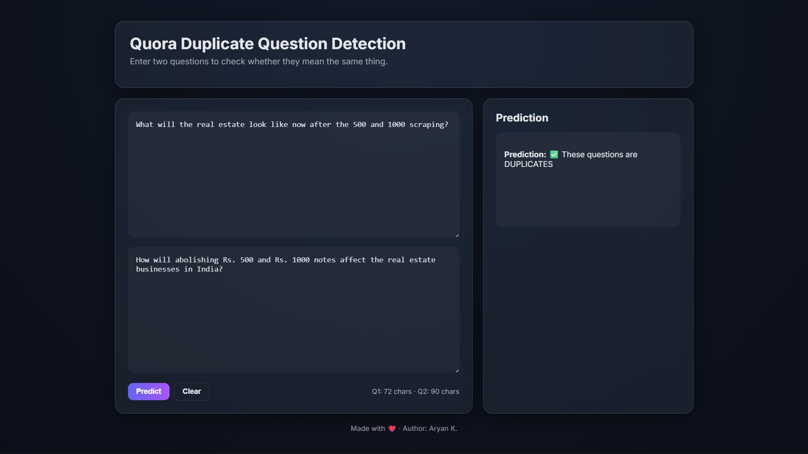
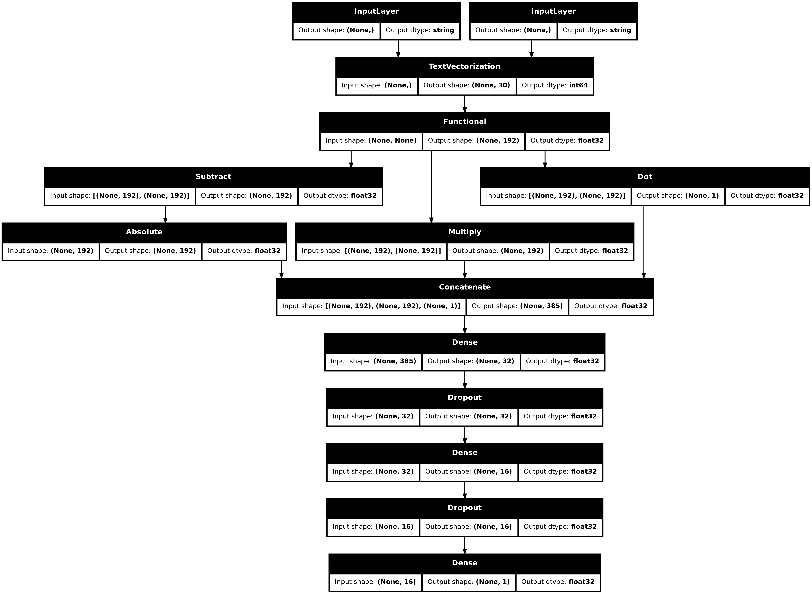

# Quora Duplicate Question Prediction

## 📌 Project Overview
The Quora Duplicate Question Prediction project focuses on automatically determining whether two user-submitted questions express the same underlying intent, even when they differ significantly in wording or structure. On large community-driven platforms like Quora, users often ask semantically identical questions using different vocabulary, grammar, or phrasing. This leads to duplicated content, fragmented answers, and reduced search efficiency.

The objective of this project is to build an intelligent system that can understand the semantic meaning of natural language, rather than relying on surface-level keyword matching. The model is designed to identify paraphrases, handle synonyms, recognize contextual similarity, and remain robust to variations such as spelling differences, grammatical reordering, and informal language usage.

To achieve this, the project leverages Natural Language Processing (NLP) techniques for text normalization, linguistic consistency, and token-level representation, combined with deep learning architectures capable of modeling long-range dependencies in text. A Siamese neural network framework is employed to encode both questions into a shared semantic space, enabling direct comparison of their learned representations.

Final Model Performance: ROC-AUC = 91%, demonstrating strong discriminative power and robust generalization.

more detailed stats:

Accuracy : 0.83045628786942

Precision: 0.7291560247460128

Recall   : 0.8604534342453367

F1 Score : 0.7893823253813422

ROC AUC  : 0.9160387760643739

---

## Model Architecture
